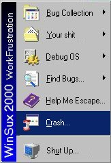

## A Windows 95/98/NT/2000 Parody \- UPDATED\!\!\!\!

### Description

This is a cool parody of Windows 95/98/NT/2000 that looks just like the real thing. The difference lies in the details...

This update of WinS*x 2000 WorkFrustration includes the following new features:

a) lots of new graphical effects, including an improved Start Menu with MouseOver code,

b) a FREE, off-line version of MicroSh*t's Homepage! Just click the Internet Explorer icon!

c) a virus scanner that REALLY WORKS! Open the Find Bugs menu in the Start Menu, and click 'Scan for viruses'!

d) NEW LOOK - actual wallpaper and icons from Windows 2000 Professional!!!

e) a log-in screen.

The ZIP file is 261 Kb but it's worth the download! (NOTE: This is an old version; download the new one at http://www.planet-source-code.com/vb/scripts/ShowCode.asp?txtCodeId=34826&lngWId=1  )
 
### More Info
 

             |
---                |---
**Submitted On**   |2000-02-19 16:18:36
**By**             |[Benny Rossaer](https://github.com/Planet-Source-Code/PSCIndex/blob/master/ByAuthor/benny-rossaer.md)
**Level**          |Intermediate
**User Rating**    |4.5 (135 globes from 30 users)
**Compatibility**  |VB 5\.0, VB 6\.0
**Category**       |[Jokes/ Humor](https://github.com/Planet-Source-Code/PSCIndex/blob/master/ByCategory/jokes-humor__1-40.md)
**World**          |[Visual Basic](https://github.com/Planet-Source-Code/PSCIndex/blob/master/ByWorld/visual-basic.md)
**Archive File**   |[CODE\_UPLOAD34822192000\.zip](https://github.com/Planet-Source-Code/benny-rossaer-a-windows-95-98-nt-2000-parody-updated__1-6149/archive/master.zip)

